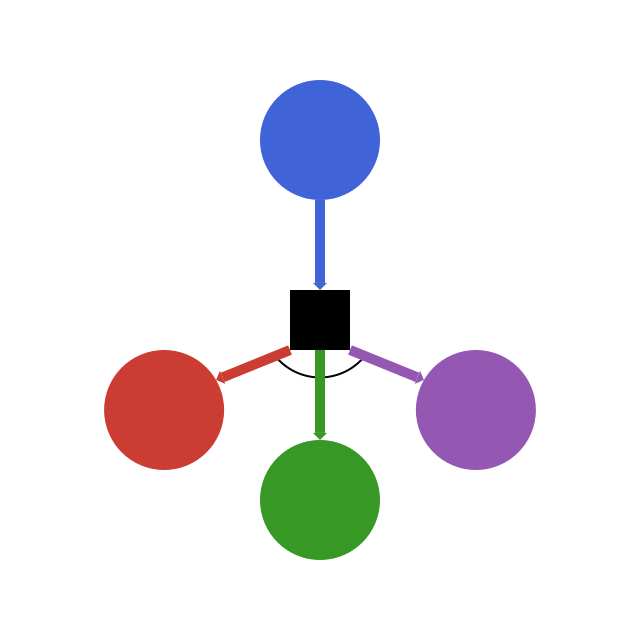

<div align="center">
  <p>
  
  </p>

  <p>
  <a href="https://JuliaReinforcementLearning.github.io/ReinforcementLearning.jl/latest"></a>
  <a href="https://travis-ci.com/JuliaReinforcementLearning/ReinforcementLearning.jl"></a>
  </p>
</div>

[**ReinforcementLearning.jl**](https://github.com/JuliaReinforcementLearning/ReinforcementLearning.jl), as the name says, is a package for reinforcement learning research in Julia.

Our design principles are:

- **Reusability and extensibility**: Provide elaborately designed components and interfaces to help users implement new algorithms.
- **Easy experimentation**: Make it easy for new users to run benchmark experiments, compare different algorithms, evaluate and diagnose agents.
- **Reproducibility**: Facilitate reproducibility from traditional tabular methods to modern deep reinforcement learning algorithms.

## Get Started

```julia
julia> ] add ReinforcementLearning

julia> using ReinforcementLearning

julia> run(E`JuliaRL_BasicDQN_CartPole`)
```

<details>
  <summary>Click to show the runtime result!</summary>

## JuliaRL_BasicDQN_CartPole

This experiment uses three dense layers to approximate the Q value.
The testing environment is CartPoleEnv.

Agent and statistic info will be saved to: `/home/runner/work/JuliaReinforcementLearning.github.io/JuliaReinforcementLearning.github.io/checkpoints/JuliaRL_BasicDQN_CartPole_2020_08_06_14_51_55`
You can also view the tensorboard logs with `tensorboard --logdir /home/runner/work/JuliaReinforcementLearning.github.io/JuliaReinforcementLearning.github.io/checkpoints/JuliaRL_BasicDQN_CartPole_2020_08_06_14_51_55/tb_log`
To load the agent and statistic info:
```
agent = RLCore.load("/home/runner/work/JuliaReinforcementLearning.github.io/JuliaReinforcementLearning.github.io/checkpoints/JuliaRL_BasicDQN_CartPole_2020_08_06_14_51_55", Agent)
BSON.@load joinpath("/home/runner/work/JuliaReinforcementLearning.github.io/JuliaReinforcementLearning.github.io/checkpoints/JuliaRL_BasicDQN_CartPole_2020_08_06_14_51_55", "stats.bson") total_reward_per_episode time_per_step
```

```
ReinforcementLearningCore.Experiment
├─ agent => ReinforcementLearningCore.Agent
│  ├─ policy => ReinforcementLearningCore.QBasedPolicy
│  │  ├─ learner => ReinforcementLearningZoo.BasicDQNLearner
│  │  │  ├─ approximator => ReinforcementLearningCore.NeuralNetworkApproximator
│  │  │  │  ├─ model => Flux.Chain
│  │  │  │  │  └─ layers
│  │  │  │  │     ├─ 1
│  │  │  │  │     │  └─ Flux.Dense
│  │  │  │  │     │     ├─ W => 128×4 Array{Float32,2}
│  │  │  │  │     │     ├─ b => 128-element Array{Float32,1}
│  │  │  │  │     │     └─ σ => typeof(NNlib.relu)
│  │  │  │  │     ├─ 2
│  │  │  │  │     │  └─ Flux.Dense
│  │  │  │  │     │     ├─ W => 128×128 Array{Float32,2}
│  │  │  │  │     │     ├─ b => 128-element Array{Float32,1}
│  │  │  │  │     │     └─ σ => typeof(NNlib.relu)
│  │  │  │  │     └─ 3
│  │  │  │  │        └─ Flux.Dense
│  │  │  │  │           ├─ W => 2×128 Array{Float32,2}
│  │  │  │  │           ├─ b => 2-element Array{Float32,1}
│  │  │  │  │           └─ σ => typeof(identity)
│  │  │  │  └─ optimizer => Flux.Optimise.ADAM
│  │  │  │     ├─ eta => 0.001
│  │  │  │     ├─ beta
│  │  │  │     │  ├─ 1
│  │  │  │     │  │  └─ 0.9
│  │  │  │     │  └─ 2
│  │  │  │     │     └─ 0.999
│  │  │  │     └─ state => IdDict
│  │  │  │        ├─ ht => 32-element Array{Any,1}
│  │  │  │        ├─ count => 0
│  │  │  │        └─ ndel => 0
│  │  │  ├─ loss_func => typeof(ReinforcementLearningCore.huber_loss)
│  │  │  ├─ γ => 0.99
│  │  │  ├─ batch_size => 32
│  │  │  ├─ min_replay_history => 100
│  │  │  ├─ rng => Random.MersenneTwister
│  │  │  └─ loss => 0.0
│  │  └─ explorer => ReinforcementLearningCore.EpsilonGreedyExplorer
│  │     ├─ ϵ_stable => 0.01
│  │     ├─ ϵ_init => 1.0
│  │     ├─ warmup_steps => 0
│  │     ├─ decay_steps => 500
│  │     ├─ step => 1
│  │     ├─ rng => Random.MersenneTwister
│  │     └─ is_training => true
│  ├─ trajectory => 0-element ReinforcementLearningCore.Trajectory
│  │  ├─ state => 4×0 view(::ReinforcementLearningCore.CircularArrayBuffer{Float32,2}, :, 1:0) with eltype Float32
│  │  ├─ action => 0-element view(::ReinforcementLearningCore.CircularArrayBuffer{Int64,1}, 1:0) with eltype Int64
│  │  ├─ reward => 0-element ReinforcementLearningCore.CircularArrayBuffer{Float32,1}
│  │  ├─ terminal => 0-element ReinforcementLearningCore.CircularArrayBuffer{Bool,1}
│  │  ├─ next_state => 4×0 view(::ReinforcementLearningCore.CircularArrayBuffer{Float32,2}, :, 2:1) with eltype Float32
│  │  └─ next_action => 0-element view(::ReinforcementLearningCore.CircularArrayBuffer{Int64,1}, 2:1) with eltype Int64
│  ├─ role => DEFAULT_PLAYER
│  └─ is_training => true
├─ env => ReinforcementLearningEnvironments.CartPoleEnv: ReinforcementLearningBase.SingleAgent(),ReinforcementLearningBase.Sequential(),ReinforcementLearningBase.PerfectInformation(),ReinforcementLearningBase.Deterministic(),ReinforcementLearningBase.StepReward(),ReinforcementLearningBase.GeneralSum(),ReinforcementLearningBase.MinimalActionSet()
├─ stop_condition => ReinforcementLearningCore.StopAfterStep
│  ├─ step => 10000
│  ├─ cur => 1
│  └─ progress => ProgressMeter.Progress
├─ hook => ReinforcementLearningCore.ComposedHook
│  └─ hooks
│     ├─ 1
│     │  └─ ReinforcementLearningCore.TotalRewardPerEpisode
│     │     ├─ rewards => 0-element Array{Float64,1}
│     │     └─ reward => 0.0
│     ├─ 2
│     │  └─ ReinforcementLearningCore.TimePerStep
│     │     ├─ times => 0-element ReinforcementLearningCore.CircularArrayBuffer{Float64,1}
│     │     └─ t => 791027816977
│     ├─ 3
│     │  └─ ReinforcementLearningCore.DoEveryNStep
│     │     ├─ f => ReinforcementLearningZoo.var"#106#111"
│     │     ├─ n => 1
│     │     └─ t => 0
│     ├─ 4
│     │  └─ ReinforcementLearningCore.DoEveryNEpisode
│     │     ├─ f => ReinforcementLearningZoo.var"#108#113"
│     │     ├─ n => 1
│     │     └─ t => 0
│     └─ 5
│        └─ ReinforcementLearningCore.DoEveryNStep
│           ├─ f => ReinforcementLearningZoo.var"#110#115"
│           ├─ n => 10000
│           └─ t => 0
└─ description => "This experiment uses three dense layers to approximate the Q value...."
```

</details>

Check out the [get started](https://juliareinforcementlearning.org/get_started/) page for more detailed explanation!

## Project Structure

`ReinforcementLearning.jl` itself is just a wrapper around several other packages inside the [JuliaReinforcementLearning](https://github.com/JuliaReinforcementLearning) org. The relationship between different packages is described below:

<pre>+-------------------------------------------------------------------------------------------+
|                                                                                           |
|  <a href="https://github.com/JuliaReinforcementLearning/ReinforcementLearning.jl">ReinforcementLearning.jl</a>                                                                 |
|                                                                                           |
|      +------------------------------+                                                     |
|      | <a href="https://github.com/JuliaReinforcementLearning/ReinforcementLearningBase.jl">ReinforcementLearningBase.jl</a> |                                                     |
|      +--------|---------------------+                                                     |
|               |                                                                           |
|               |         +--------------------------------------+                          |
|               |         | <a href="https://github.com/JuliaReinforcementLearning/ReinforcementLearningEnvironments.jl">ReinforcementLearningEnvironments.jl</a> |                          |
|               |         |                                      |                          |
|               |         |     (Conditionally depends on)       |                          |
|               |         |                                      |                          |
|               |         |     <a href="https://github.com/JuliaReinforcementLearning/ArcadeLearningEnvironment.jl">ArcadeLearningEnvironment.jl</a>     |                          |
|               +--------&gt;+     <a href="https://github.com/JuliaReinforcementLearning/OpenSpiel.jl">OpenSpiel.jl</a>                     |                          |
|               |         |     <a href="https://github.com/JuliaPOMDP/POMDPs.jl">POMDPs.jl</a>                        |                          |
|               |         |     <a href="https://github.com/JuliaPy/PyCall.jl">PyCall.jl</a>                        |                          |
|               |         |     <a href="https://github.com/JuliaReinforcementLearning/ViZDoom.jl">ViZDoom.jl</a>                       |                          |
|               |         |     Maze.jl(WIP)                     |                          |
|               |         +--------------------------------------+                          |
|               |                                                                           |
|               |         +------------------------------+                                  |
|               +--------&gt;+ <a href="https://github.com/JuliaReinforcementLearning/ReinforcementLearningCore.jl">ReinforcementLearningCore.jl</a> |                                  |
|                         +--------|---------------------+                                  |
|                                  |                                                        |
|                                  |          +-----------------------------+               |
|                                  |---------&gt;+ <a href="https://github.com/JuliaReinforcementLearning/ReinforcementLearningZoo.jl">ReinforcementLearningZoo.jl</a> |               |
|                                  |          +-----------------------------+               |
|                                  |                                                        |
|                                  |          +----------------------------------------+    |
|                                  +---------&gt;+ <a href="https://github.com/JuliaReinforcementLearning/ReinforcementLearningAnIntroduction.jl">ReinforcementLearningAnIntroduction.jl</a> |    |
|                                             +----------------------------------------+    |
+-------------------------------------------------------------------------------------------+
</pre>

