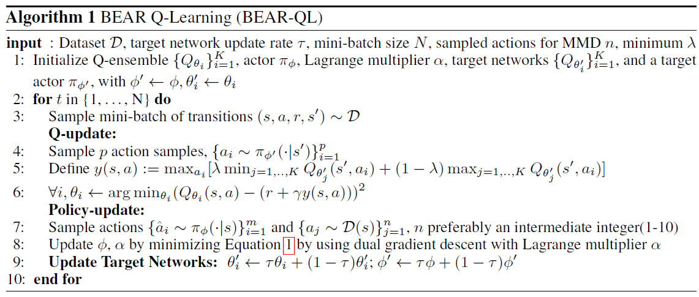

@def title = "Enriching Offline Reinforcement Learning Algorithms in ReinforcementLearning.jl"
@def description = """
    This is the phase 2 technical report of the summer OSPP project [Enriching Offline Reinforcement Learning Algorithms in ReinforcementLearning.jl](https://summer.iscas.ac.cn/#/org/prodetail/210370539?lang=en). The report is split into the following parts:  [**Project Information**](/blog/phase2_technical_report_of_enriching_offline_reinforcement_learning_algorithms_in_reinforcement_learning_jl/#project_information) and [**Completed Work**](/blog/phase2_technical_report_of_enriching_offline_reinforcement_learning_algorithms_in_reinforcement_learning_jl/#completed_work).
    """
@def is_enable_toc = true
@def has_code = true
@def has_math = true

@def front_matter = """
    {
        "authors": [
            {
                "author":"Guoyu Yang",
                "authorURL":"https://github.com/pilgrimygy",
                "affiliation":"Nanjing University, LAMDA Group",
                "affiliationURL":"https://www.lamda.nju.edu.cn"
            }
        ],
        "publishedDate":"2021-09-27",
        "citationText":"Guoyu Yang, 2021"
    }"""

@def appendix = """
    ### Corrections
    If you see mistakes or want to suggest changes, please [create an issue](https://github.com/JuliaReinforcementLearning/ReinforcementLearning.jl/issues) in the source repository.
    """

@def bibliography = "bibliography.bib"

# Technical Report
This technical report is the second phase technical report of Project "Enriching Offline Reinforcement Learning Algorithms in ReinforcementLearning.jl" in OSPP. It includes two components: project information and completed work.

## Project Information
- Project name: Enriching Offline Reinforcement Learning Algorithms in ReinforcementLearning.jl
- Scheme Description: Recent advances in offline reinforcement learning make it possible to turn reinforcement learning into a data-driven discipline, such that many effective methods from the supervised learning field could be applied. Until now, the only offline method provided in ReinforcementLearning.jl is Behavior Cloning (BC)\dcite{michie1990cognitive}. We'd like to have more algorithms added like Batch Constrain deep Q-Learning (BCQ)\dcite{DBLP:conf/icml/FujimotoMP19}, Conservative Q-Learning (CQL)\dcite{DBLP:conf/nips/KumarZTL20}. It is expected to implement at least three to four modern offline RL algorithms.
- Time planning: the following is a relatively simple time table.
  
| Date       | Work    |
| :-:       | :-:   |
| Prior - June 30   | Preliminary research, including algorithm papers, ReinforcementLearning.jl library code, etc. |
| The first phase |      |
| July1 - July15  | Design and build the framework of offline RL.  |
| July16 - July31 | Implement and experiment offline DQN and  offline SAC as benchmark. |
| August1 - August15 | Write build-in documentation and technical report. Implement and experiment CRR.|
| The second phase |      |
| August16 - August31 | Implement and experiment PLAS. |
| September1 - September15  | Research, implement and experiment new SOTA offline RL algorithms. |
| September16 - September30 | Write build-in documentation and technical report. Buffer for unexpected delay. |
| After project | Carry on fixing issues and maintaining implemented algorithms.   |
## Completed Work

It summarizes all the results of the second phase.
#### Offline RL algorithms

In the second phase, we finished the offline RL algorithms: BCQ, Discrete-BCQ, BEAR(UWAC), FisherBRC. CRR and PLAS are detailed in the report of the first phase. Except for algorithms in discrete action space (such as Discrete-BCQ, Discrete-CRR), all algorithms can run on CPU and GPU, because `CartesianIndex` is not supported in GPU.

##### BCQ
Batch-Constrained deep Q-Learning (BCQ) uses distribution matching to constrain policy. The pseudocode of BCQ:

\dfig{body;BCQ.png}

BCQ needs to train a VAE to sample actions based on the next state. We train VAE for a period of time, and then train VAE and BCQ learner simultaneously to ensure the quality of the generated actions. When sampling actions, we randomly samples hidden states instead of generating hidden states in PLAS\dcite{DBLP:journals/corr/abs-2011-07213}. Therefore, we re-implement `decode` function in VAE:
```julia
function decode(rng::AbstractRNG, model::VAE, state, z=nothing; is_normalize::Bool=true)
    if z === nothing
        # In BCQ case. In PLAS case if z !== nothing.
        z = clamp.(randn(rng, Float32, (model.latent_dims, size(state)[2:end]...)), -0.5f0, 0.5f0)
        z = send_to_device(device(model), z)
    end
    a = model.decoder(vcat(state, z))
    if is_normalize
        a = tanh.(a)
    end
    return a
end
```

And it needs a [perturbation network](https://juliareinforcementlearning.org/docs/rlcore/#ReinforcementLearningCore.PerturbationNetwork-Tuple{Any,%20Any}):
```julia
Base.@kwdef struct PerturbationNetwork{N}
    base::N
    ϕ::Float32 = 0.05f0
end
```
Perturbation network is used to increase the robustness of the action:

```julia
function (model::PerturbationNetwork)(state, action)
    x = model.base(vcat(state, action))
    x = model.ϕ * tanh.(x)
    clamp.(x + action, -1.0f0, 1.0f0)
end
```

Please refer to this link for specific code ([link](https://juliareinforcementlearning.org/docs/rlzoo/#ReinforcementLearningZoo.BCQLearner-Tuple{})). The brief function parameters are as follows:
```julia
mutable struct BCQLearner{BA1, BA2, BC1, BC2, V} <: AbstractLearner
    ### Omit other parameters
    policy::BA1
    target_policy::BA2
    qnetwork1::BC1
    qnetwork2::BC2
    target_qnetwork1::BC1
    target_qnetwork2::BC2
    vae::V
    p::Int
    start_step::Int
end
```
In BCQ, we use `PerturbationNetwork`: $\pi(s,a)\rightarrow a$ to model policy and use $Q(s,a)$ to model Q-network.

`p` is a hyper-parameter used for repeating states to obtain better Q estimation. For example, BCQ repeats states and obtains the actions and Q-values. Then it chooses an action with the highest Q-value.
```julia
function (l::BCQLearner)(env)
    s = send_to_device(device(l.policy), state(env))
    s = Flux.unsqueeze(s, ndims(s) + 1)
    s = repeat(s, outer=(1, 1, l.p))
    action = l.policy(s, decode(l.vae.model, s))
    q_value = l.qnetwork1(vcat(s, action))
    idx = argmax(q_value)
    action[idx]
end
```
`start_step` represents the steps to train VAE alone.

Performance curve of BCQ algorithm in Pendulum (`start_step=1000`):

\dfig{body;JuliaRL_BCQ_Pendulum.png}

##### Discrete BCQ
Discrete BCQ\dcite{fujimoto2019benchmarking} is a simple offline RL algorithm in discrete action space. Its pseudocode is as follow:

\dfig{body;DBCQ.png}

The core of Discrete BCQ is calculating a mask of actions. We calculate the probability of actions in a given state and divide it by the maximum probability value. Then, we compare this value with the threshold. If this value is less than the threshold, the corresponding action will not be selected.

```julia
prob = softmax(learner.approximator.actor(s), dims=1)
mask = Float32.((prob ./ maximum(prob, dims=1)) .> learner.threshold)
new_q = q .* mask .+ (1.0f0 .- mask) .* -1f8
```

Please refer to this link for specific code ([link](https://juliareinforcementlearning.org/docs/rlzoo/#ReinforcementLearningZoo.BCQDLearner)). The brief function parameters are as follows:
```julia
mutable struct BCQDLearner{Aq, At} <: AbstractLearner
    ### Omit other parameters
    approximator::Aq
    target_approximator::At
    θ::Float32
    threshold::Float32
end
```

In Discrete BCQ, we use the Actor-Critic structure. The Critic is modeled as $Q(s,\cdot)$, and the Actor is modeled as $L(s,\cdot)$ (likelihood of the state).

`θ` is the regularization coefficient. When calculating the loss in Discrete BCQ, it uses the likelihood of the state to regularize:
```julia
logit = AC.actor(s)
actor_loss + critic_loss + θ * mean(logit .^ 2)
```

Performance curve of Discrete BCQ algorithm in CartPole:

\dfig{body;JuliaRL_BCQD_CartPole.png}

##### BEAR & UWAC
Bootstrapping error accumulation reduction (BEAR) \dcite{DBLP:conf/nips/KumarFSTL19} is a policy-constraint method, which uses support constrain instead of distribution matching in BCQ. Its pseudocode is as follow:

\dfig{body;BEAR.png}


The equation 1:

$$\pi_\phi := \max_{\pi \in \triangle_{|S|}}\mathbb{E}_{s\in \mathcal{D}}\mathbb{E}_{a\sim\pi(\cdot|s)}\big[\min_{j=1,\cdots,K}\hat{Q}_j(s,a)\big] \\ s.t. \mathbb{E}_{s\in\mathcal{D}}[{\rm MMD}(\mathcal{D}(s),\pi(\cdot|s))]\leq \varepsilon$$

The Actor update is the main improvement part of BEAR. We need to train a VAE to simulate sampling action from the dataset. The training of the VAE and the learner are synchronized. Then we sample action by the Actor and calculate maximum mean discrepancy (MMD) loss:

```julia
function maximum_mean_discrepancy_loss(raw_sample_action, raw_actor_action, type::Symbol, mmd_σ::Float32=10.0f0)
    A, B, N = size(raw_sample_action)
    diff_xx = reshape(raw_sample_action, A, B, N, 1) .- reshape(raw_sample_action, A, B, 1, N)
    diff_xy = reshape(raw_sample_action, A, B, N, 1) .- reshape(raw_actor_action, A, B, 1, N)
    diff_yy = reshape(raw_actor_action, A, B, N, 1) .- reshape(raw_actor_action, A, B, 1, N)
    diff_xx = calculate_sample_distance(diff_xx, type, mmd_σ)
    diff_xy = calculate_sample_distance(diff_xy, type, mmd_σ)
    diff_yy = calculate_sample_distance(diff_yy, type, mmd_σ)
    mmd_loss = sqrt.(diff_xx .+ diff_yy .- 2.0f0 .* diff_xy .+ 1.0f-6)
end
```
The loss of actor is:

$$J=-Q_{\hat{\theta}}(s,a) + \alpha \times {\rm MMD}(\mathcal{D}(s),\pi(\cdot|s))$$

Besides, lagrangian multiplier $\alpha$ needs to be updated synchronously:

$$J=-Q_{\hat{\theta}}(s,a) + \alpha \times ({\rm MMD}(\mathcal{D}(s),\pi(\cdot|s))-\varepsilon)$$

Please refer to this link for specific code ([link](https://juliareinforcementlearning.org/docs/rlzoo/#ReinforcementLearningZoo.BEARLearner-Tuple{})). The brief function parameters are as follows:

```julia
mutable struct BEARLearner{BA1, BA2, BC1, BC2, V, L} <: AbstractLearner
    ### Omit other parameters
    policy::BA1
    target_policy::BA2
    qnetwork1::BC1
    qnetwork2::BC2
    target_qnetwork1::BC1
    target_qnetwork2::BC2
    vae::V
    log_α::L
    ε::Float32
    p::Int
    max_log_α::Float32
    min_log_α::Float32
    sample_num::Int
    kernel_type::Symbol
    mmd_σ::Float32
end
```

In BEAR, we use $Q(s, a)$ to model the Q-network and use a gaussian network to model the policy. `log_α` is a Lagrange multiplier implemented by a `NeuralNetworkApproximator`.

`ε` is used to update the Lagrangian multiplier. `p` is a hyper-parameter like BCQ. `max_log_α` and `min_log_α` are used to clamp the `log_α`. `sample_num` represents how many samples we sample to calculate MMD loss. `mmd_σ` is used to adjust the size of MMD loss. `kernel_type=:laplacian/:gaussian` represents what method we use to calculate MMD loss:
```julia
function calculate_sample_distance(diff, type::Symbol, mmd_σ::Float32)
    if type == :gaussian
        diff = diff .^ 2
    elseif type == :laplacian
        diff = abs.(diff)
    else
        error("Wrong parameter.")
    end
    return vec(mean(exp.(-sum(diff, dims=1) ./ (2.0f0 * mmd_σ)), dims=(3, 4)))
end
```

Performance curve of BEAR algorithm in Pendulum:

\dfig{body;JuliaRL_BEAR_Pendulum.png}

Uncertainty Weighted Actor-Critic (UWAC)\dcite{DBLP:conf/icml/0001ZSSZSG21} is an improvement of BEAR. It can be implemented by adding Dropout in BEAR's Q network.

##### FisherBRC
FisherBRC\dcite{DBLP:conf/icml/KostrikovFTN21} is a policy-constraint offline RL algorithm, which uses Fisher distance to constrain policy. The pseudocode of FisherBRC:

\dfig{body;FisherBRC.png}

Firstly, it needs to pre-train a behavior policy $\mu$ using Behavior Cloning. In official python implementation, it adds an entropy term in the negative log-likelihood of actions in a given state. Mathematical formulation:

$$\mathcal{L}(\mu) = \mathbb{E}[-\log \mu(s|a) + \alpha \mathcal{H}(\mu)]$$

Besides, it automatically adjusts entropy term like SAC:

$$J(\alpha) = -\alpha \mathbb{E}_{a_t\sim \mu_t}[\log\mu(a_t|s_t) + \bar{\mathcal{H}}]$$

Where $\bar{\mathcal{H}}$ is target entropy. But in [ReinforcementLearningZoo.jl](https://github.com/JuliaReinforcementLearning/ReinforcementLearning.jl/tree/master/src/ReinforcementLearningZoo), [`BehaviorCloningPolicy`](https://juliareinforcementlearning.org/docs/rlzoo/#ReinforcementLearningZoo.BehaviorCloningPolicy-Union{Tuple{},%20Tuple{A}}%20where%20A) does not contain the entropy term and does not support continuous action space. So, we define `EntropyBC`:
```julia
mutable struct EntropyBC{A<:NeuralNetworkApproximator}
    policy::A
    α::Float32
    lr_alpha::Float32
    target_entropy::Float32
    # Logging
    policy_loss::Float32
end
```
Users only need to set parameter `policy` and `lr_alpha`. `policy` usually uses a [`GaussianNetwork`](https://juliareinforcementlearning.org/docs/rlcore/#ReinforcementLearningCore.GaussianNetwork). `lr_alpha` is the learning rate of `α`, which is an entropy term. `target_entropy` is set to $-\dim(\mathcal{A})$, and $\mathcal{A}$ is action space.

Afterward, the FisherBRC learner is updated. When updating Actor, it adds an entropy term in Q-value loss and automatically adjusts entropy. It updates Critic by this equation:

$$\min_\theta J(O_\theta + \log\mu(a|s)) + \lambda \mathbb{E}_{s\sim D, a\sim \pi_\phi(\cdot|s)}[\|\nabla_a O_\theta(s,a)\|^2]$$

There are a few key concepts that need to be introduced. $J$ is the standard Q-value loss function. $O_\theta(s,a)$ is offset network:

$$Q_\theta(s,a) = O_\theta(s,a) + \log\mu(a|s)$$

Instead of $Q_\theta(s,a)$, $O_\theta(s,a)$ will provide a richer representation of Q-values. However, this parameterization can potentially put us back in the fully-parameterized $Q_\theta$ regime of vanilla actor critic. So it uses a gradient penalty regularizer of the form $\|\nabla_a O_\theta(s,a)\|$. The implementation is as follows: 

```julia
a_policy = l.policy(l.rng, s; is_sampling=true)
q_grad_1 = gradient(Flux.params(l.qnetwork1)) do
    q1 = l.qnetwork1(q_input) |> vec
    q1_grad_norm = gradient(Flux.params([a_policy])) do 
        q1_reg = mean(l.qnetwork1(vcat(s, a_policy)))
    end
    reg = mean(q1_grad_norm[a_policy] .^ 2)
    loss = mse(q1 .+ log_μ, y) + l.f_reg * reg  # y is target value
end
```

Please refer to this link for specific code ([link](https://juliareinforcementlearning.org/docs/rlzoo/#ReinforcementLearningZoo.FisherBRCLearner-Tuple{})). The brief function parameters are as follows:

```julia
mutable struct FisherBRCLearner{BA1, BC1, BC2} <: AbstractLearner
    ### Omit other parameters
    policy::BA1
    behavior_policy::EntropyBC
    qnetwork1::BC1
    qnetwork2::BC2
    target_qnetwork1::BC1
    target_qnetwork2::BC2
    α::Float32
    f_reg::Float32
    reward_bonus::Float32
    pretrain_step::Int
    lr_alpha::Float32
    target_entropy::Float32
end
```
In FisherBRC, policy is modeled as gaussian network and Q-network is modeled as $O(s,a)$.

`f_reg` is the regularization parameter of $\|\nabla_a O_\theta(s,a)\|$. `reward_bonus` is generally set to 5, which is added in the reward to improve performance. `pretrain_step` is used for pre-training `behavior_policy`. `α`, `lr_alpha` and `target_entropy` are parameters used to add an entropy term and automatically adjust the entropy.

Performance curve of FisherBRC algorithm in Pendulum (`pertrain_step=100`):

\dfig{body;JuliaRL_FisherBRC_Pendulum.png}

#### Offline RL experiments
To show performance of the above algorithms, we add some built-in experiments in [ReinforcementLearningExperiments.jl](https://github.com/JuliaReinforcementLearning/ReinforcementLearning.jl/tree/master/src/ReinforcementLearningExperiments).

If it is an algorithm on the continuous action space, we test it in [Pendulum](https://juliareinforcementlearning.org/docs/rlenvs/#ReinforcementLearningEnvironments.PendulumEnv-Tuple{}), otherwise we test it on [CartPole](https://juliareinforcementlearning.org/docs/rlenvs/#ReinforcementLearningEnvironments.CartPoleEnv-Tuple{}).

We collect the dataset by `gen_JuliaRL_dataset` function ([source](https://juliareinforcementlearning.org/docs/rlzoo/#ReinforcementLearningZoo.gen_JuliaRL_dataset-Tuple{Symbol,%20Symbol,%20AbstractString})):

```julia
struct JuliaRLTransition
    state
    action
    reward
    terminal
    next_state
end

function gen_JuliaRL_dataset(alg::Symbol, env::Symbol, type::AbstractString; dataset_size::Int)
    dataset_ex = Experiment(
            Val(:GenDataset),
            Val(alg),
            Val(env),
            type;
            dataset_size = dataset_size)
    
    run(dataset_ex)

    dataset = []
    s, a, r, t = dataset_ex.policy.trajectory.traces
    for i in 1:dataset_size
        push!(dataset, JuliaRLTransition(s[:, i], a[i], r[i], t[i], s[:, i+1]))
    end
    dataset
end
```

Specifically, we first run the built-in data collection experiment. For CartPole environment, we use BasicDQN to collect the dataset. For Pendulum, SAC is used. Then we turn the trajectory into a vector of `JuliaRLTranstion`.

We can run the [offline RL experiments](https://juliareinforcementlearning.org/docs/experiments/#Offline) with the following commands (list all supported commands):
```julia
run(E`JuliaRL_BCQ_Pendulum(type)`)
run(E`JuliaRL_BCQD_CartPole(type)`)
run(E`JuliaRL_BEAR_Pendulum(type)`)
run(E`JuliaRL_CRR_Pendulum(type)`)
run(E`JuliaRL_CRR_CartPole(type)`)
run(E`JuliaRL_FisherBRC_Pendulum(type)`)
run(E`JuliaRL_PLAS_Pendulum(type)`)
```
`type` represents the method of collecting dataset, which can be `random`, `medium` or `expert`. `random` means dataset generated by the random agent, and `medium` uses an agent trained from scratch to convergence, and `expert` uses an agent that has converged. For example:

```julia
run(E`JuliaRL_BCQ_Pendulum(medium)`)
```

## Conclusion
The implemented algorithms in this project contain most of the policy constraint methods in offline reinforcement learning (including distribution matching, support constrain, implicit constraint, behavior cloning). And these algorithms cover both discrete and continuous action spaces. Besides, we have them tested with various datasets, including random, medium, and expert.