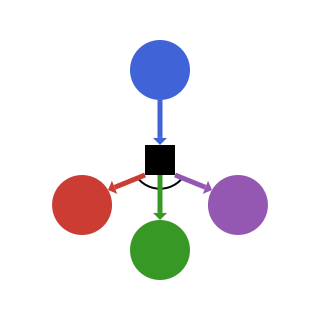

**ReinforcementLearning.jl**, as the name says, is a package for reinforcement learning research in Julia.

Our design principles are:

- **Reusability and extensibility**: Provide elaborately designed components and interfaces to help users implement new algorithms.
- **Easy experimentation**: Make it easy for new users to run benchmark experiments, compare different algorithms, evaluate and diagnose agents.
- **Reproducibility**: Facilitate reproducibility from traditional tabular methods to modern deep reinforcement learning algorithms.

Key capabilities/features include:

- Well tested traditional methods:
    - [`TDLearner`](@ref)
    - [`DifferentialTDLearner`](@ref)
    - [`TDλReturnLearner`](@ref)
    - [`DoubleLearner`](@ref)
    - [`MonteCarloLearner`](@ref)
    - [`GradientBanditLearner`](@ref)
    - [`ReinforcePolicy`](@ref)

- Efficiently implemented deep reinforcement learning algorithms:
    - Deep Q-Learning:
        - [`BasicDQNLearner`](@ref)
        - [`DQNLearner`](@ref)
        - [`PrioritizedDQNLearner`](@ref)
        - [`RainbowLearner`](@ref)

- Pluggable deep learning framework backend:
    - [Flux.jl](https://github.com/FluxML/Flux.jl)
    - [Knet.jl](https://github.com/denizyuret/Knet.jl)

- Built-in [TensorBoard](https://github.com/PhilipVinc/TensorBoardLogger.jl) support.


## Installation

This package can be installed from the package manager in Julia's REPL:

```
] add ReinforcementLearning
```

!!! note
    This package relies on many new features introduced since [Julia 1.3](https://julialang.org/downloads/), so make sure that you have the proper Julia version installed. Considering that this package is still under rapid development, you're strongly suggested to install the master branch of this package by the following steps:
    1. Make sure that your Julia version is `v1.3-rc3` or above
    1. `git clone git@github.com:JuliaReinforcementLearning/ReinforcementLearning.jl.git`
    1. `cd ReinforcementLearning.jl`
    1. `julia --project=.`
    1. `] instantiate`

    
To play with some common reinforcement learning environments, you may also want to install:

```
] add ReinforcementLearningEnvironments
```