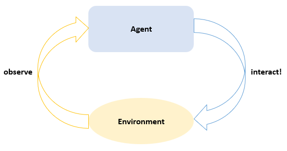
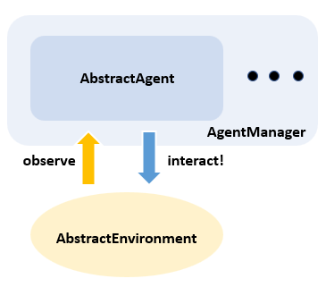
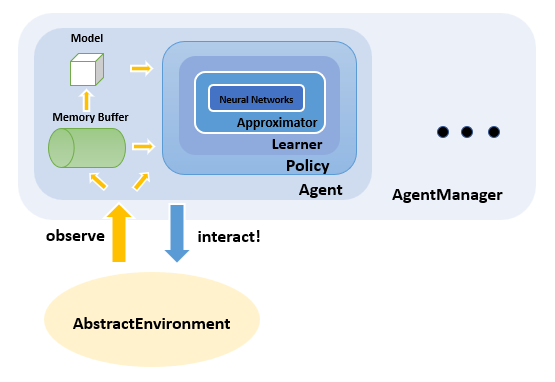

# Overview

Before diving into details, let's review some basic concepts in **RL(Reinforcement Learning)** first. Then we'll gradually introduce the relationship between those concepts and our implementations in this package.

## Key Concepts

### Agent and Environment

Generally speaking, RL is to learn how to take actions so as to maximize a numerical reward. Two core concepts in RL are **Agent** and **Environment**. In each step, the agent is provided with some observation of the environment and is required to take an action. Then the environment takes in that action and transites to another state, providing a numerical reward in the meantime.

In our package, **Agent** is an abstract type of [`AbstractAgent`](@ref). And **Environment** is an abstract type of `AbstractEnvironment` provided in another package named [ReinforcementLearningEnvironments.jl](https://github.com/JuliaReinforcementLearning/ReinforcementLearningEnvironments.jl). We can `observe` an environment to get an [`Observation`](@ref) and `interact!` with an environment using an action. Usually, agents and environments are functional objects. So we can use the piping operator (`|>`) to simulate the steps implied in the above picture: `env |> observe |> agent |> env`. See [Agents](@ref) and [Environments](@ref) for more some concrete implementations.

For multi-agent environments, an `AgentManager` is introduced to manage the interactions between agents and environments (for now it's just a `Tuple`).

Now let's take a closer look at [`Agent`](@ref):

This is a typical hierarchical chart of different components. After getting an [`Observation`](@ref) from the envrionment, the [Agents](@ref) use it to fill [Buffers](@ref) and update [Environment Models](@ref) and [Policies](@ref). A policy is used to generate an action given an [`Observation`](@ref). Usually a policy contains [Learners](@ref) to decide how to update internal [Approximators](@ref). A typical approximator is [`NeuralNetworkQ`](@ref), which uses neural networks to approximator state-action values.

Notice that different components may have different implementations, so some steps are optional. Anyway, this picture should give you a perceptual knowledge of how those components are organized. You can move on and read the introduction of each components for more details.