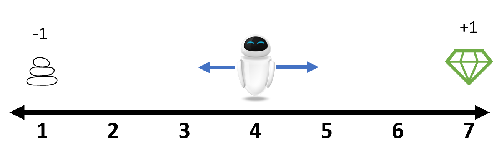

# Tutorial

## One-dimensional Random Walk

Suppose that an agent is placed at the position `4` on the following number line.
At each step, it can either move left or right. Here we use the integer `1` and
`2` to represent them respectively. Whenever it reaches the end of the line, the
game is terminated. A reward of `+1` is received if it stops at position 7
and a punishment of `-1` is received if it stops at position 1. In other cases,
the reward is `0`.



This environment is already provided as [`RandomWalk1D`](@ref).
Let's get familiar with some basic interfaces first.

```@repl randomwalk1d
using ReinforcementLearning
env = RandomWalk1D()
S = state_space(env)
s = state(env)  # the initial position
A = action_space(env)
is_terminated(env)
while true
    env(rand(A))
    is_terminated(env) && break
end
state(env)
reward(env)
```

You can find more detailed explanation of the functions used above at
[ReinforcementLearningBase.jl](@ref).

In this simple game, we are interested in finding out an optimum policy for the
agent to gain the maximum cumulative reward in an episode. The random selection
policy above is a good benchmark. The only thing left is to calculate the total
reward. Because such workflow is so common in reinforcement learning tasks, an
extended `Base.run` function is provided so that we can design the workflow in
a descriptive pattern.

```@repl randomwalk1d
run(
    RandomPolicy(),
    RandomWalk1D(),
    StopAfterEpisode(10),
    TotalRewardPerEpisode()
)
```

The [`RandomPolicy`](@ref) simply draws a random element from the legal action
set at each step. Beyond that, we can also set the action at each position ahead
of time by using a [`TabularPolicy`](@ref).

```@repl randomwalk1d
NS, NA = length(S), length(A)
policy = TabularPolicy(;table=Dict(zip(1:NS, fill(2, NS))))
run(
    policy,
    RandomWalk1D(),
    StopAfterEpisode(10),
    TotalRewardPerEpisode()
)
```

Next, let's introduce one of the most common policies, the
[`QBasedPolicy`](@ref). It contains two parts, a state-action value function to
estimate the estimated value of each state-action pair and an explorer to select
which action to take based on the result of the state-action values.

```@repl randomwalk1d
using Flux: InvDecay
policy = QBasedPolicy(
    learner = MonteCarloLearner(;
            approximator=TabularQApproximator(
                ;n_state = NS,
                n_action = NA,
                opt = InvDecay(1.0)
            )
        ),
    explorer = EpsilonGreedyExplorer(0.1)
)
```

Here we choose the [`MonteCarloLearner`](@ref) and the
[`EpsilonGreedyExplorer`](@ref). But you can also replace them with some other Q
value learners or value explorers. Similar to what we did before, we can apply
this policy to the `env` to estimate its performance.

```@repl randomwalk1d
run(
    policy,
    RandomWalk1D(),
    StopAfterEpisode(10),
    TotalRewardPerEpisode()
)
```

Until now, the policies we've seen are very simple ones. There're no
optimizations involved in these policies. We call that they are in the **actor**
mode, which means they only generate actions statically at each step. However,
our main goal in reinforcement learning is to improve our policy during the
interactions with the environments. We say the policy is in the **learner** mode
in this case. To run policies in the **learner** mode, a dedicated wrapper policy
[`Agent`](@ref) is provided.

```@repl randomwalk1d
agent = Agent(
    policy = policy,
    trajectory = VectorSARTTrajectory()
)
run(agent, env, StopAfterEpisode(10), TotalRewardPerEpisode())
```

Here the [`VectorSARTTrajectory`](@ref) is used to store the **S**tate,
**A**ction, **R**eward, is_**T**erminated info during interactions with the environment.
