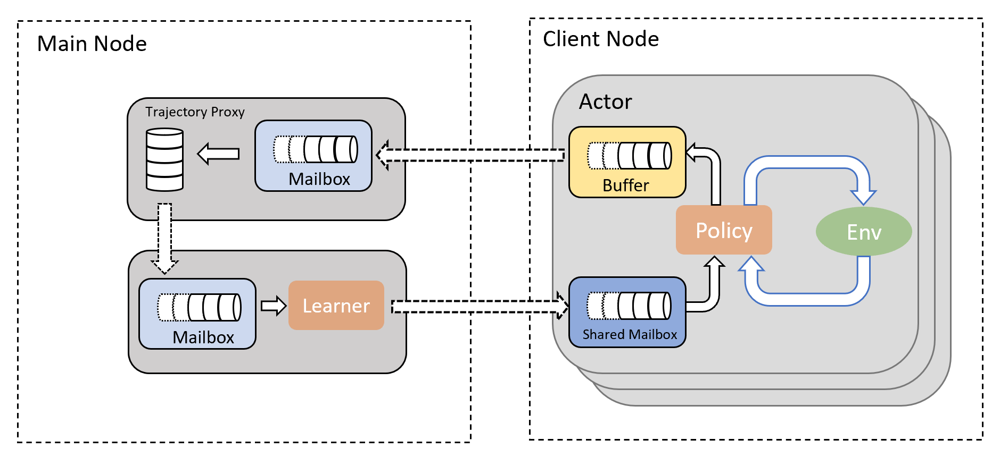

 If it works, it works everywhere!

  

## Design

### Components

- 👷 **Worker**, a worker creates a task to run an experiment in background. It periodically sends out transitions between agent and environment, and fetches latest parameter.
- 📢 **WorkerProxy**, a worker proxy collects messages from/to workers on the same node so that some message data (model params) can be shared across different workers.
- 💿 **TrajectoryManager**, a trajectory manager is a wrapper around an `AbstractTrajectory`. It takes in a bulk of transitions and samples a batch of training data in respond to request.
- 💡 **Trainer**, a trainer is a wrapper around an `AbstractPolicy`, it does nothing but to update its internal parameters when received a batch of training data and periodically broadcast its latest parameters.
- ⏱️ **Orchestrator**, an orchestrator is in charge of controlling the start, stop and the speed of communications between the above components.

Note that:

1. We adopt the [actor model](https://en.wikipedia.org/wiki/Actor_model) here. Each instance of the above components is an actor. Only messages are passing between them.
1. A node is a process in Julia. Different nodes can be on one machine or across different machines.
1. Tasks in different workers are initiated with `Threads.@spawn`. There's no direct communication between them by design.
1. In single node environment (`WorkerNode` and `MainNode` are the same one), the **WorkerProxy** can be removed and workers communicate with **Orchestrator** directly.

### Messages

- 1️⃣ (👷 → 📢) `InsertTransitionMsg`, contains the local transitions between agent and environment in an experiment.
- 2️⃣ (📢 → ⏱️) `InsertTransitionMsg` from different workers.
- 3️⃣ (⏱️ → 💿) `InsertTransitionMsg` and `SampleBatchMsg` (which contains the address of **Trainer**). 
- 4️⃣ (💿 → 💡) `BatchTrainingDataMsg`
- 5️⃣ (💡 → 💿) `UpdatePriorityMsg`, only necessary in prioritized experience replay related algorithms.
- 6️⃣ (💡 → ⏱️) `LoadParamsMsg`, contains the latest parameters of the policy.
- 7️⃣ (⏱️ → 📢) `LoadParamsMsg`
- 8️⃣ (📢 → 👷) `LoadParamsMsg`
